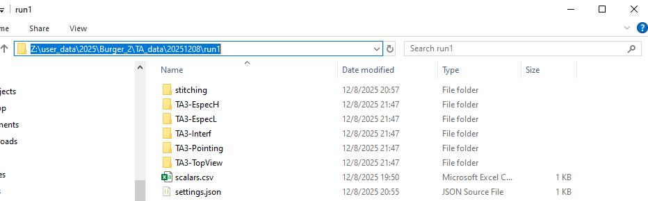
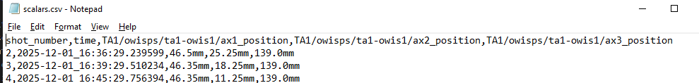
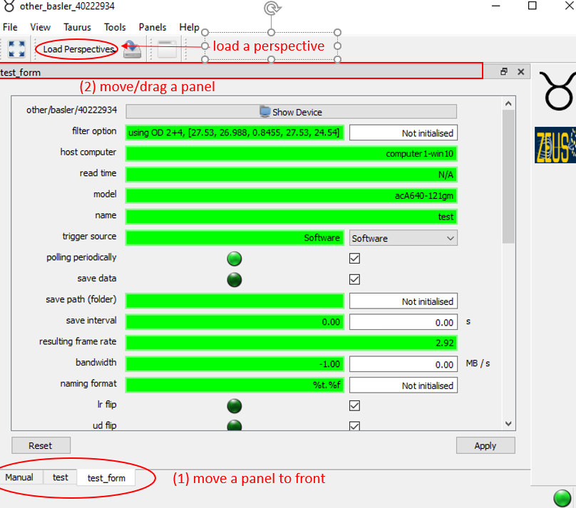
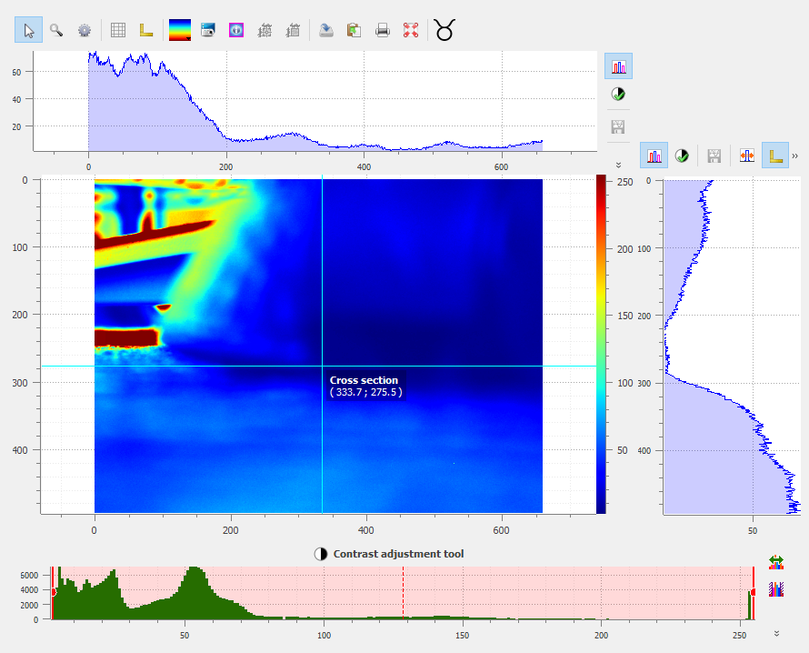

Instructions on how to acquire data using the ZEUS DAQ app.

# 1 Start the program

To start the DAQ app, run the batch file at: "...\ZEUS_Tango_control\shortcut\Windows\DAQ.bat". A main "ZEUS DAQ GUI" window will pop up.

# 2 Devices

## 2.1 Select the device servers

To select the device servers, click "Select" button. Only the devices that output image/array type data are shown in the pop-up windows, such as cameras, oscilloscope, spectrometers. If some of your devices don't show up here, you can add them to the database (See [FAQ](#7-faq) section).  
As we select the devices to be used in the experiment, new buttons appear on the main windows. The buttons have the device names on them and use a gray background (Device Buttons).
To acquire and save the scalar data, use [Metadata Window](#33-save-metadata).

## 2.2 Start the device servers

If the selected device servers haven't been started somewhere else, we need to start them by clicking the Device Buttons. The device servers don't have to be started on the data acquisition computer. Instead they can be started from:  
(1) Any computers in the lab if the devices support ethernet communication.  
(2) The computer that connects to the devices if it doesn't support ethernet communication. For example, a USB camera.  
Blue background colors of the Device Buttons indicate the device servers are started successfully on current computer.

## 2.3 Generate GUI for images

Click "Device GUI" after the device servers have been started successfully and a Taurus window will pop up. This window usually has multiple panels stacked together.

## 2.4 Bandwidth

When we have multiple device servers selected, it is better to assign bandwidth for each device. Only the bandwidths of the Basler cameras need to be adjusted here. However, a small portion of the Basler cameras don't support the API called here and their bandwidth values are shown as -1. A common practice is to enter 80 in the "Allowed bandwidth" field and then click "Optimized". Sometimes we need to click "Optimized" twice to achieve the same "Resulting fps". Since the theoretical bandwidth is around 120 MB/s, we still leave 40 MB/s for other cameras (Andor, Allied Vision) and other applications (browsers, Remote Desktop, etc.). We probably should also use Pylon Viewer to assign bandwidth for the cameras that show "-1" bandwidth manually.

# 3 Option

## 3.1 Save background images

We usually don't check this. This sends a software trigger to the cameras. It has some limitations.

## 3.2 save an extra image by stitching

We usually check this. The DAQ will save an extra image by stitching the images from all devices. Each small image in this big image is stretched to fit into the tile. The pixel value is changed to enhance the contrast, which means we can't determine if an image is the saturated from the stitched image. The purpose of the stitched image is only for quick review.

## 3.3 Save Metadata

Check this to save scalar data. Click "Metadata" button next to the option. In the pop-up Metadata Window, select scalars you would like to save along with the images. Click "validate" to validate the scalars are accessible. The scalar data are saved in a ".csv" file and the file is in the same directory level with the camera folder level. Refer to screenshot in the [Acquisition](#4-acquisition) section for details.

# 4 Acquisition

Here is a screenshot of the data format of the saved data. The "Save path" is set as "Z:\user_data\2025\Burger_2\TA_data\20251208\run1". In this directory, there are one folder for each device, one folder for stitched image, one "scalars.csv" file to store the scalars checked in Metadata Window and one "settings.json" for Basler camera settings.  
  
This is the format of the saved scalars. The columns "shot number" and "time" are appended to each row automatically.  

The image naming format is "Shot[shot number]\_Time[].tiff", for example, "Shot2_Time16-36-28.138403.tiff".

## 4.1 Save path

## 4.2 Start End

The Start shot number is defined here. This needs to be changed when resuming from a shooting break. For example, during a break, we often want to click "Stop" to stop acquisition in case of unwanted triggers. When we resume data acquisition, we sometimes prefer to pick up the previous shot number instead starting from shot number 1 again. This affects the naming of the saved images.
The End shot number is useful when we use continuous triggering and when the laser side can't control the number of triggers sent.

## 4.3 Scan

This module probably should be moved to Option frame in the future. Open "Scan Module" window and we see 4 sections here.
Section "Scannable Device". Check the attributes that need to be scanned over. The selected attributes appear on the header of Scan Table.
Section "Scan Table". The scan list appears here. We can select rows and "Remove Selected" to modify the list.
Section "Starting shot number". The default number is 1. Sometimes if we would like to start a scan from a certain shot number, we can enter the shot number here.
Section "Input". Enter value for each attribute and "Add to list".
After each shot, the attributes will be set to the desired values automatically.

## Start/Stop

Make sure you have gone over all the procedures above and read the logging information, and then click "Start". Click "Stop" to stop acquisition.

# 5 Logging

This frame shows important messages during data acquisition. Please always read them before every shot. For example,
(1) A message "shot xx is completed". This message indicates we have acquired data from all selected devices. An audio also plays when this message shows up.
(2) If we notice an inconsistency of shot numbers from various devices, we need to figure out the problems before proceeding. Two common cases indicating the inconsistency. First, when "shot xx is completed" doesn't show up or the audio doesn't play. This means some of the devices haven't been able to output the data. Second, some devices output more images than they should. This is often due to extra false triggers.

# 6 Common operations on the Taurus GUI.

## 6.1 Taurus GUI

Here is a screenshot of an example.  

Common operations include:  
(1) Move a panel to front.  
(2) Drag a panel and move. Sometimes you need to unlock view before dragging.  
(3) Lock View. This option is under "view" in the menu. Select the option to toggle between lock and unlock.  
(4) Set up the layout of multiple panels. In most cases, we would like to "tile all the panels" so that we can see all the panels without switching between them. To do this, we firstly need to expand the main window so that it has enough space to dock all the panels. Panels usually have a minimum size which is determined by the contents in it. Secondly, we drag a panel to the edge of the main windows and a "split view" frame should appear (if not, expand the main windows more). Release the dragging and the panel should be docked to the requested location. During this operation, we may need to use (1) (2) (3) mentioned above.  
(5) Save/load the perspective. The options are under "view" in the menu. If we are satisfied with the layout, we probably want to save the perspective so that we can later load it without manually dragging panels again. We suggest saving multiple perspectives for various purposes. For example, we hope we can see all the details of the devices and change the device parameters before starting to shoot. But we might not want to see the form panel during shoot due to limited space on the screen. Name them with "all" and "image", or just "1" and "2".  
A saved perspective is only valid for the specific set of devices.

## 6.2 Form panel

A form panel is a panel that contains attributes reading/writing values in a form format. The green highlighted values are the reading values we are concerned of. Press "ENTER" to confirm input. The "Apply" button in the bottom right is usually not needed. Press "CTRL" + "ENTER" to force applying the current value.

## 6.3 Image panel

A few commonly used functionalities are mentioned here. Remember any modifications to the image (i.e., the visualization of the collected data) from the image panel will not affect the data collected.  

With "Mouse"/"Selection" icon selected,  
(1) Left button click selects an object which can be the image, a ROI, a cross section, etc.  
(2) Wheel button click resets the image size and position. Wheel button drag moves the image.  
(3) Right button click opens a list of commands. Right button drag zooms in/out the image.  
Right clicking the image opens a list of commands. A few common commands are:
(4) "Contrast adjustment" starts a "Contrast adjustment tool" to the button of the coordinate system. Be sure the image object is selected. Two ways to adjust the contrast. (a) Use the two buttons to the right of this tool. They are used to automatically adjust the contrast. Mouseover to read details. (b) Drag the lower limit and upper limit to manually change the limits. The coordinate system (e.g., the x axis range) of the tool can be adjust by right clicking on the system.

# 7 FAQ

## How to add a new device server?

### Add device by following the prompt.

run the batch file at: "...\ZEUS_Tango_control\shortcut\Windows\add_new_device.bat". Or run the command in the terminal:

```
python "...\ZEUS_Tango_control\register\register_device_server.py"
```

We will need to provide "server/instance", "class" and "device name". For Basler cameras, a convention is enter the "user defined name" in the Pylon as the "device name" in Tango. For example, if you select "Basler" and enter "TA1-SomeCamera" as the name, automatically "server/instance" will be set to "Balser/TA1-SomeCamera", class will be set to "Basler" and device name will be set to "TA3/basler/TA1-SomeCamera". All these parameters should be case insensitive.

### Pre-enter all the information and then add the device.

Another way to add a new device server is provide the needed information first by editing the script file and appending the reg_dict dictionary. Then run

```
python "...\ZEUS_Tango_control\register\script.py" add [the newly added dict key]
```

The advantage here is we have many examples in the reg_dict dictionary.

## Can I start another client during shooting?

Yes. You can start multiple clients on multiple computers. This is useful  
(1) when you are not the one who is operating the data acquisition computer but you still want to see the image closely in real time.
(2) when you sometimes want to access the image from both laser side, target areas and control room.
